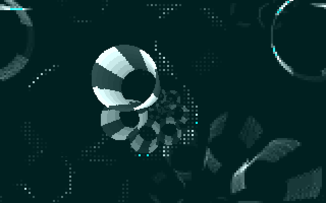

# Spirward

A tiny (256b) demo for DOS* featuring forward projection of a spiral.



* And some other platforms as well.

## Building

### Supported Platforms

This demo supports multiple build targets:

- **Linux** - Native build with SDL2 for visualization and testing
- **Windows** - Cross-compiled with MinGW32 and SDL2
- **DOS (EXE)** - Cross-compiled with DJGPP for DOS systems
- **DOS (COM)** - Pure assembly 256-byte demo, the original target format

### Requirements

To build all targets, you'll need:

- **NASM** assembler (for all builds)
- **GCC** (for Linux builds)
- **MinGW32 cross-compiler** (`i686-w64-mingw32-gcc`) for Windows builds
- **DJGPP cross-compiler** (`i586-pc-msdosdjgpp-gcc`) for DOS builds
- **SDL2** development libraries (for Linux and Windows builds)

For just the 256-byte COM demo, you only need NASM.

### Building the Demo

The project uses a Makefile with several targets:

```bash
# Build for your current platform (auto-detected) + DOS + COM
make

# Build specific platforms
make linux          # Build Linux version with SDL2
make windows        # Build Windows version (MinGW32)
make dos            # Build DOS EXE version (DJGPP)
make com            # Build 256-byte COM file

# Build everything
make all-targets    # Cross-compile for all platforms

# Run the demo (builds and runs for current platform)
make run

# Clean build artifacts
make clean

# For advanced assembly options (NO_VSYNC, SCANLINE, RETURN_TO_DOS), see Makefile help:
make help
```

The compiled binaries are placed in the `bin/` directory:
- `spirward-linux` - Linux executable
- `spirward-windows.exe` - Windows executable (requires SDL2 libraries)
- `spirward.exe` - DOS executable (requires CWSDPMI.EXE)
- `spirward.com` - 256-byte DOS COM file

### Running the Demo

**On Linux:**
```bash
./bin/spirward-linux
```

**On Windows:**
```bash
bin\spirward-windows.exe
```

**Note:** The Windows executable requires SDL2.dll to be present in the same directory or in your system PATH.

**On DOS** (or DOSBox):

For the COM file:
```cwd
bin\spirward.com
```

For the EXE file (requires 32-bit DOS extender `CWSDPMI.EXE` in the same directory):
```cwd
bin\spirward.exe
```

The COM file is the original 256-byte demo format and runs directly on DOS or in DOSBox. The EXE version is built with DJGPP and requires the `CWSDPMI.EXE` DOS extender to be present in the `bin/` directory.

**Performance Note:** For DOS/DOSBox, the demo works best with at least 100,000 CPU cycles, preferably 400,000 or higher for smooth rendering. In DOSBox, you can adjust this with `cycles=400000` in your configuration or press `Ctrl+F12` to increase cycles at runtime.

## Math

If you are interested in the math behind this demo, here it goes.

### The Spiral Surface

The demo renders a 3D surface shaped like a spiral staircase. Mathematically, this surface is defined by _UV coordinates_, that is, two parameters:
- **u**: the vertical height that controls how far along the spiral you travel
- **v**: controls where you are around the circular cross-section (like walking around a tube)

For any pair of coordinates $(u, v)$, we compute a 3D point in space using:

$$
\begin{align*}
x &= R\sin u + r\cos v \\
y &= R\cos u - r\sin v \\
z &= u
\end{align*}
$$

where $R$ is the major radius (how far the spiral's center is from the origin) and $r$ is the minor radius (the thickness of the spiral tube). The second coordinate $v$ goes a full circle, that is $v\in [0, 2\pi]$.

### Perspective Projection

To display this 3D spiral on a 2D screen of certain width $W$ and height $H$, we use perspective projection—the same principle cameras use. Objects farther away appear smaller and closer to a vanishing point.

First, we transform the world coordinates into **camera space** by subtracting the camera position:

$$
\mathbf{P}_{\text{camera}} = \mathbf{P}_{\text{world}} - \mathbf{P}_{\text{eye}}
$$

This centers the coordinate system on the camera's viewpoint.

Then we project onto the screen plane using a pinhole camera model with focal length $f$, centered at the screen's middle:

$$
\begin{align*}
x_{\text{screen}} &= \frac{W}{2} + \frac{f \cdot x_{\text{camera}}}{z_{\text{camera}}} \\
y_{\text{screen}} &= \frac{H}{2} + \frac{f \cdot y_{\text{camera}}}{z_{\text{camera}}}
\end{align*}
$$

The division by $z_{\text{camera}}$ creates the perspective effect: points with larger $z$ (farther from camera) get divided by a bigger number, making them appear smaller and closer to the vanishing point.

### Sampling Strategy

Instead of blindly sampling the spiral at uniform $u$ intervals, we compute *which $u$ values will actually appear at each screen row* (more or less).

Assume for a moment that we **don't** center the height. Distant points get rendered at $y_{\text{screen}} = 0$, and the close ones have large $y_{\text{screen}}$. For a point on the spiral's central axis, the projection formula becomes:

$$
y_{\text{screen}} = \frac{f \cdot (0 - y_{\text{eye}})}{z - z_{\text{eye}}}
$$

Since $z = u$ for our spiral, we can solve for $u$:

$$
u = z_{\text{eye}} - \frac{f \cdot y_{\text{eye}}}{y_{\text{screen}}}
$$

By evaluating this formula for evenly-spaced screen rows ($y_{\text{screen}}$ from 1 to screen height), we get a list of $u$ values that map to those rows. These $u$ values are naturally denser where the perspective effect compresses more geometry—near the vanishing point at the top of the screen. We discarded the offset $\tfrac{H}{2}$ in our calculation, so the procedure above is only an approximation.

This gives us **non-uniform sampling tuned to the perspective distortion**, reducing gaps in coverage (and wasted precious samples that get rendered to the same screen pixels).

But what about $v$? How many points do we need? This will be explained in a further section.

### Texturing

Since we've got _UV coordinates_ at hand, it is very easy to draw textures on the surface.

#### Checkerboard Pattern

Of course, the classical checkerboard pattern comes in very handy:

$$
\lfloor U\rfloor \oplus \lfloor V\rfloor = \begin{cases}
0,&\text{if }\lfloor U\rfloor + \lfloor V\rfloor \equiv 0 \pmod{2}\\
1,&\text{if }\lfloor U\rfloor + \lfloor V\rfloor \equiv 1 \pmod{2}
\end{cases}
$$

Setting $V = \tfrac{4v}{\pi}$ lets us divide the spiral circles into eight equal parts, since $v \in [0, 2\pi]$. For the sake of simplicity, we can leave $U = u$.

#### Lighting Model

Realistic lighting often uses distance-based attenuation with formulas like $\frac{1}{1 + d^2}$ where $d$ is the distance from the camera. For our size-constrained demo, we use a simpler approximation that exploits the sampling strategy.

We can index our sample points by $i$, where $i \propto \frac{1}{u}$, approximately. So using $i$ as a proxy for lighting gives us intensity roughly proportional to $\frac{1}{u}$—a crude but effective distance-based falloff.

#### Color Computation

The final pixel color combines the checkerboard pattern with the lighting:

$$
\text{color} = \text{pattern} \times \text{light}
$$

I think this is rather self-explanatory.

### Rasterization Procedure

So, in summary: for each sampled $(u, v)$ pair:
1. Compute the 3D surface point
2. Project it to screen coordinates
3. Calculate the color
4. Render to the screen

## Simplifications

Calculating everything directly from the formulas is definitely not a feasible way to write a demo, even using FPU. So we keep our constants simple ($0$ if possible), and it would be best to avoid factors (other than $1$, that is).

### Sampling Strategy (Once Again)

First of all, we need to map all heights, from $1$ to $200$ (that's the target height dimension) to $u$'s. From our previous sampling formula, we naturally get:

$$
u_i = -\frac{f y_{\text{eye}}}{i}
$$

for $i = 1, \ldots, 200$, and a very natural choice of $x_{\text{eye}} = z_{\text{eye}} = 0$.

It turns out that letting $y_{\text{eye}} = -2\pi$ simplifies a lot of calculations, giving:

$$
u_i = \frac{2\pi f}{i}
$$

To render the surface, since we process each $(u, v)$ pair, we can do that straightforwardly using a double nested `for` loop. We defined $u$, but we still need to determine the number of samples for each $u$.

One may notice that for a fixed $u_i$, the image for $v \in [0, 2\pi]$ is actually a regular circle. Since our unit is a single pixel, we can calculate the circumference of the projected circle to get an estimate of the number of samples needed to fill the circle without gaps, but without too many wasted samples as well.

The circumference in question is:

$$
\frac{2\pi f}{u_i} = \frac{2\pi f}{-\tfrac{f y_e}{i}} = \frac{2\pi f i}{2\pi f} = i
$$

Isn't that nice?

#### Render Loop

Instead of recalculating the projection directly from the formula for every point, we use an incremental approach. For each $i$ (and its corresponding $u_i$), we calculate the initial projected position $(p_x, p_y)$ of the spiral's center at that height.

Let's introduce $v_{\text{step}} = \frac{\pi}{i}$. Since we need to sample around a full circle ($2\pi$), using this step size we'd need $2i$ steps. However, we'll increment by $2v_{\text{step}}$ in our loop, taking only $i$ steps total. This definition of $v_{\text{step}}$ turns out to be very convenient for the math that follows.

Recall the spiral surface formula:

$$
\begin{align*}
x &= R \sin u + r \cos v \\
y &= R \cos u - r \sin v \\
z &= u
\end{align*}
$$

We split this into the **major radius** term (the spiral's central path) and the **minor radius** term (the tube cross-section). We compute the projected center position for $v = 0$:

$$
\begin{align*}
p_x &= \frac{W}{2} + \frac{f\left(R \sin u + r \cos v\right)}{u} =
\frac{W}{2} + \frac{f(R \sin u + r)}{\frac{2\pi f}{i}} = \frac{W}{2} + \frac{R \sin u + r}{2v_{\text{step}}} \\
p_y &= \frac{H}{2} + \frac{f\left(R \cos u - r \sin v\right)}{u} =
\frac{H}{2} + \frac{f R \cos u}{\frac{2\pi f}{i}} = \frac{H}{2} + \frac{R \cos u}{2v_{\text{step}}}
\end{align*}
$$

To simplify calculations further, we discard shifts by constants like $\tfrac{r}{2v_{\text{step}}}$. You may start to wonder... where's the convenience if we use $2v_{\text{step}}$? Trigonometric functions vary from $-1$ to $1$. To increase the curvature of the spiral, we may now simply set $R = 2$ and $r = 2$, and the coefficients cancel out.

As $v$ increases, the minor radius terms change, but instead of recomputing them from scratch, we use derivatives:

$$
\frac{d}{dv}\left[\frac{\cos v}{2 v_{\text{step}}}\right] = -\frac{\sin v}{2 v_{\text{step}}}, \quad \frac{d}{dv}\left[-\frac{\sin v}{2 v_{\text{step}}}\right] = -\frac{\cos v}{2 v_{\text{step}}}
$$

For a step of size $\Delta v = 2v_{\text{step}}$, the incremental update works out to be approximately $\frac{d}{dv}\Delta v$, that is:

$$
\begin{align*}
p_x &\leftarrow p_x - \sin v \\
p_y &\leftarrow p_y - \cos v
\end{align*}
$$

And that's it. We essentially walk around the circle incrementally.

I think that's enough. You're probably bored to death by now.
